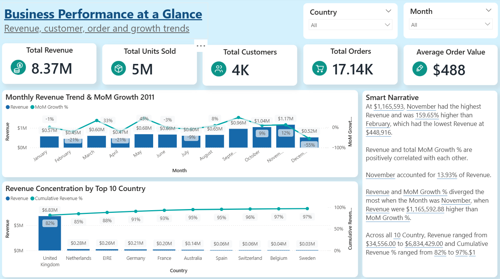
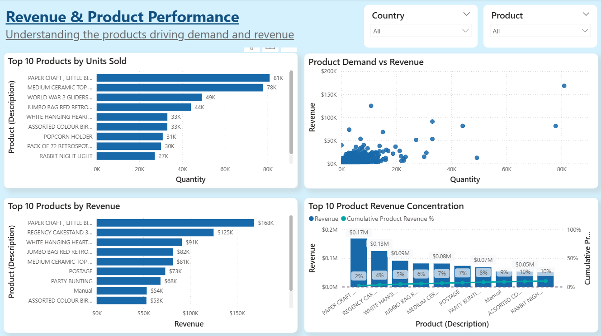
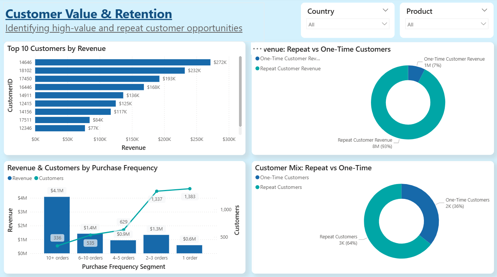
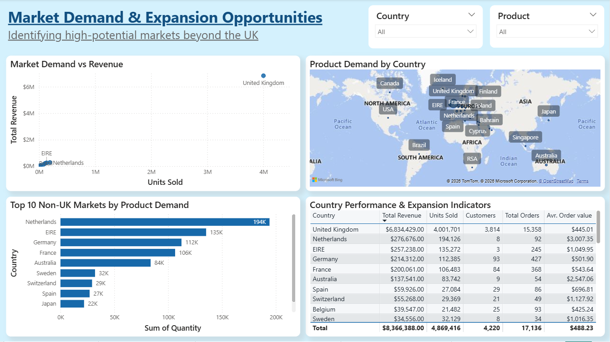

# online-retail-business-intelligence-dashboard
Power BI business intelligence dashboard analyzing retail revenue, customer behavior, product performance, and international expansion opportunities.

## 📊 Project Overview

This project transforms transactional retail data into an interactive business intelligence dashboard.

The dashboard provides insights across four key business areas:

- Executive Performance
- Revenue & Product Performance
- Customer Performance
- Expansion Opportunity

## 🎯 Business Objectives

The dashboard was designed to answer key business questions:

- How is revenue performing over time?
- Which products generate the highest revenue and demand?
- How important are repeat customers?
- Which markets demonstrate international growth potential?
- Where are the major business opportunities?

## 🛠️ Tools & Technologies

- Power BI
- DAX
- Power Query
- Microsoft Excel
- GitHub

## 📈 Dashboard Pages

### 1. Executive Overview

Provides a high-level view of:

- Total Revenue
- Total Customers
- Total Orders
- Total Units Sold
- Average Order Value
- Monthly Revenue & MoM Growth
- Revenue Concentration by Country

### 2. Revenue & Product Performance

Analyzes:

- Top Products by Units Sold
- Top Products by Revenue
- Product Demand vs Revenue
- Product Revenue Concentration

### 3. Customer Performance

Analyzes:

- Top Customers by Revenue
- Repeat vs One-Time Customer Revenue
- Purchase Frequency
- Customer Mix

### 4. Expansion Opportunity

Analyzes:

- Market Demand vs Revenue
- Product Demand by Country
- Top Non-UK Markets
- Country Performance & Expansion Indicators

## 💡 Key Business Insights

- The UK represents the largest share of revenue.
- Repeat customers contribute approximately 92.5% of revenue.
- Paper Craft, Little Birdie is the leading product by units sold and revenue.
- Several non-UK markets demonstrate meaningful product demand.
- Revenue shows noticeable monthly variation.

## 📌 Business Recommendations

1. Evaluate high-demand international markets for potential expansion.
2. Strengthen repeat-customer engagement through loyalty and personalized offers.
3. Optimize inventory around high-performing products.
4. Investigate the December revenue decline.
5. Evaluate markets using revenue, demand, customers, orders and AOV together.

## 📂 Project Structure
PowerBI/
├── Online_Retail_Business_Dashboard.pbix
└── Dashboard_Theme.json

Screenshots/
├── 01_Executive_Overview.png
├── 02_Product_Performance.png
├── 03_Customer_Performance.png
└── 04_Expansion_Opportunity.png

Documentation/
├── Business_Insights.md
└── DAX_Measures.md
